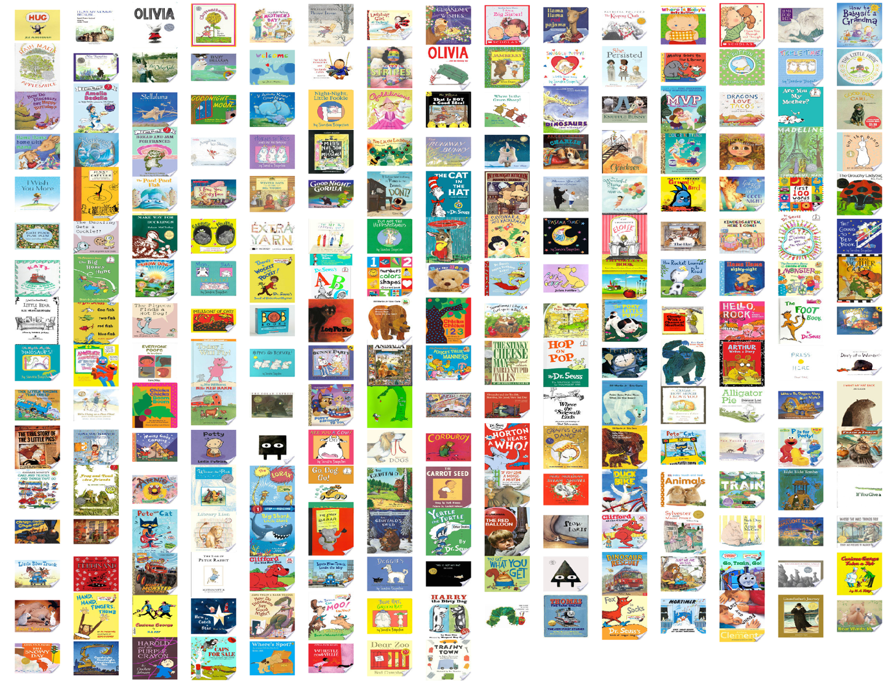

What might books be teaching young children about gender?
===

Lewis, M., Cooper Borkenhagen, M., Converse, E., Lupyan, G., & Seidenberg, M.  (2021). What might books be teaching young children about gender? _Psychological Science_. [[preprint]](https://psyarxiv.com/ntgfe) [[paper source]](https://github.com/mllewis/WCBC_GENDER/tree/master/writeups/paper/kidbookgender_psych_sci.Rmd) [[supplemental materials]](https://mlewis.shinyapps.io/SI_WCBC_GENDER/).

 

We investigate how gender is represented in children’s books using a novel 200,000 word corpus comprising 247 popular, contemporary books for young children (0-5 years). Using human judgments and word co-occurrence data, we quantified gender biases of words in individual books and in the whole corpus. We find that children’s books contain many words that adults judge as gendered. Semantic analyses based on co-occurrence data yielded word clusters related to gender stereotypes (e.g., feminine: emotions; masculine: tools). Co-occurrence data also indicate that many books instantiate gender stereotypes identified in other research (e.g., girls are better at reading and boys at math). Finally, we used large-scale data to estimate the gender distribution of the audience for individual books, and find that children tend to be exposed to gender stereotypes for their own gender. Together the data suggest that children’s books may be an early source of gender associations and stereotypes.

The file `writeups/paper/kidbookgender.Rmd` contains the text of the paper and the code for the analyses reported in the paper.  A rendered version of the paper can be found at `writeups/paper/kidbookgender.pdf`. The `analysis` directory contains all scripts used to pre-process the data before analysis. The `data` directory contains the data for the [gender word norms](data/processed/words/gender_ratings_mean.csv) (Study 1), and processed data for the corpus itself. Arrangements for public access to the corpus are under negotiation and information will be updated.  The Supplemental Information to the paper can be found at https://mlewis.shinyapps.io/SI_WCBC_GENDER/, and in the repository at `writeups/paper/SI/`.

Feel free to email me with questions and comments at mollyllewis@gmail.com.
